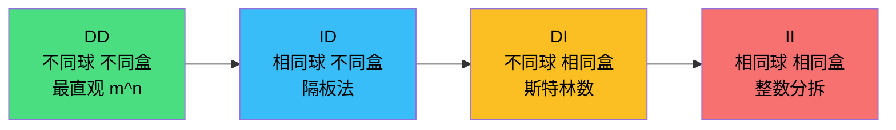
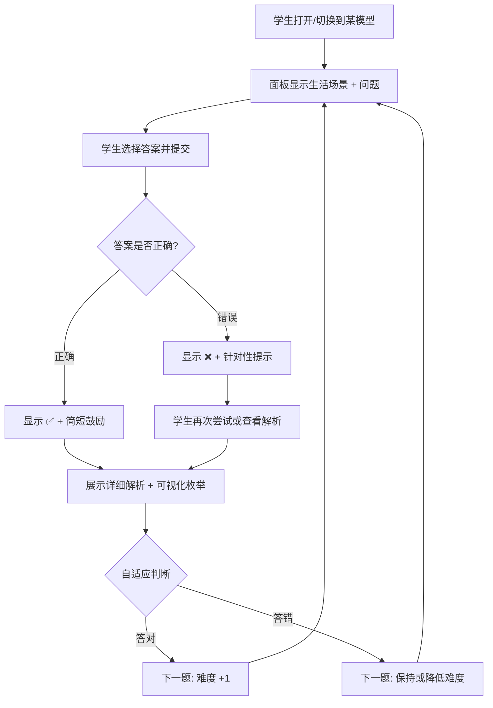
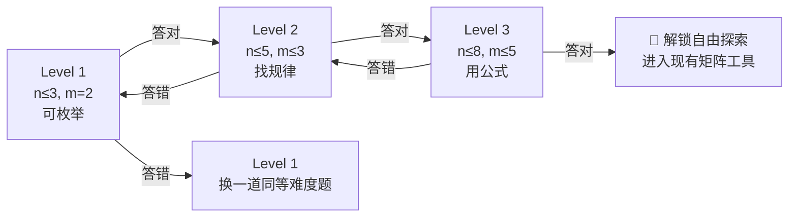

# 球盒模型教学系统改进方案

## 📋 项目背景

当前系统（[index.html](file:///E:/users/kpan/BaiduSyncdisk/program/aigc/fungame/comb/index.html)）是一个**纯展示型工具**：学生打开页面后直接面对矩阵、公式、可视化，没有任何教学引导。对于 10-14 岁的竞赛入门学生来说，存在以下核心问题：

> [!WARNING]
> **现有系统缺少"教学流程"** —— 没有先问问题、再引导思考、最后揭示规律的过程。学生不知道从哪里看起、为什么要看矩阵、递推关系是什么意思。

---

## 🎯 设计目标

| 维度 | 决策 |
|:---|:---|
| **目标学生** | 小学高年级到初中（10-14岁），竞赛入门级别 |
| **教学方式** | 在现有演示系统中嵌入引导，不新建独立页面 |
| **引导形式** | "试一试"交互式：学生先选择答案，系统判断对错后再展示解析和可视化 |
| **答题形式** | 多选题（含干扰项），学生选择正确答案 |
| **进阶系统** | 自适应：答对自动提升难度，答错保持或降低 |
| **UI呈现** | 可展开/收起的"教学引导"面板，置于可视化区域上方或下方 |

### 教学顺序（从简到难）



---

## 🏗 改进方案详细设计

### 一、"教学引导"面板 (Teaching Guide Panel)

在现有页面中，可视化演示卡片的**上方**添加一个可展开/收起的教学面板。

#### 面板结构

```
┌──────────────────────────────────────────────────┐
│ 📚 教学引导 Teaching Guide          [展开/收起] ▼  │
├──────────────────────────────────────────────────┤
│                                                  │
│  🎯 场景引入（生活化故事）                          │
│  "小明有 3 颗不同颜色的糖果，要分给 2 个好朋友..."   │
│                                                  │
│  ❓ 试一试                                        │
│  "你觉得有几种分法？"                               │
│  ○ A. 4 种   ○ B. 8 种   ○ C. 9 种   ○ D. 6 种    │
│  [提交答案]                                       │
│                                                  │
│  ✅ 答对了！/ ❌ 再想想...                          │
│  📖 解析：每颗糖果都有 2 个选择，所以...             │
│  (展示对应的可视化枚举)                              │
│                                                  │
│  [下一题 →]                                        │
│                                                  │
└──────────────────────────────────────────────────┘
```

#### 面板交互流程



---

### 二、四大核心教学元素

#### 1. 🔄 "什么是球相同、盒相同" 对比解释

这是学生**最容易混淆**的概念。在顶部模式切换区域下方，增加一个简洁的概念对比卡：

| 概念 | 生活类比 | 数学含义 |
|:---|:---|:---|
| **球不同** | 3 颗不同颜色的糖果（红🔴绿🟢蓝🔵） | 每个球有编号，交换后算不同方案 |
| **球相同** | 3 颗完全一样的白糖果（⚪⚪⚪） | 球没有编号，只看每盒几个 |
| **盒不同** | 标了名字的书包（小明的 / 小红的） | 盒子有标签，放在不同盒算不同方案 |
| **盒相同** | 3 个一模一样的透明袋子 | 盒子没有标签，只看分组情况 |

**关键对比动画**：用 n=3, m=2 的例子：
- DD（球异盒异）：2³ = **8** 种 → 展示全部 8 种
- ID（球同盒异）：C(4,1) = **4** 种 → 展示 (0,3)(1,2)(2,1)(3,0)
- DI（球异盒同）：S(3,1)+S(3,2) = **4** 种 → 展示 {ABC}, {AB|C}, {AC|B}, {BC|A}
- II（球同盒同）：p(3,2) = **2** 种 → 展示 (3) 和 (2,1)

> [!IMPORTANT]
> **同一个例子（3球2盒）在四个模型下答案分别是 8, 4, 4, 2** —— 这个对比就是让学生"恍然大悟"的关键。

#### 2. 📋 全部枚举展示

对于小数字（n ≤ 4, m ≤ 3），在解析中列出**所有可能的分配方案**：

```
例：3 个不同球放入 2 个不同盒（DD模型）

盒1    盒2      分法
───    ───      ────
🔴🟢🔵  空       第1种
🔴🟢    🔵       第2种
🔴🔵    🟢       第3种
🔴      🟢🔵     第4种
🟢🔵    🔴       第5种
🟢      🔴🔵     第6种
🔵      🔴🟢     第7种
空      🔴🟢🔵   第8种

总共 8 种 = 2³
```

#### 3. 📈 从具体到公式的过渡

每个模型的教学题目按三层递进：

| 层级 | 目标 | 示例（DD模型） |
|:---|:---|:---|
| **Level 1：感知** | 小数字，能枚举 | "2 个糖分 2 人有几种分法？"（答案 4） |
| **Level 2：发现规律** | 稍大数字，开始找规律 | "3 个糖分 2 人呢？"（答案 8）→ "发现了什么？" |
| **Level 3：归纳公式** | 引出公式 | "那 n 个糖分 m 人呢？" → 揭示 m^n |

#### 4. 💡 答错后的针对性提示

根据学生选择的**错误干扰项**，给出不同的提示：

| 场景 | 错误选项 | 提示语 |
|:---|:---|:---|
| DD 模型，3球2盒 | 选了 "6" | "你是不是在想排列？注意，每个球独立选盒子，不是从球里选给盒子哦～" |
| DD 模型，3球2盒 | 选了 "4" | "你是不是把球当成了一样的？注意，红球和蓝球交换位置算不同分法！" |
| ID 模型，3球2盒 | 选了 "8" | "你是不是把球当成不同的了？这些球是一样的，只看每盒几个就好～" |
| II 模型，3球2盒 | 选了 "4" | "你是不是把盒子当成不同的了？盒子一样的话，(1,2) 和 (2,1) 算同一种哦～" |

---

### 三、自适应难度设计



每个模型（DD/ID/DI/II）独立维护难度状态。

---

### 四、易混淆点警告（模型切换对比）

当学生在模型间切换时，弹出一个简洁的对比提示：

```
┌─────────────────────────────────────────────┐
│  💡 你切换到了「相同球 不同盒」模式           │
│                                             │
│  同样是 3 球 2 盒：                          │
│  ├ 刚才（不同球不同盒）：8 种                 │
│  └ 现在（相同球不同盒）：4 种                 │
│                                             │
│  为什么变少了？                               │
│  因为球现在是一样的，很多之前算不同的          │
│  分法现在变成了"同一种"！                     │
│                                             │
│                            [我明白了] [详细看看] │
└─────────────────────────────────────────────┘
```

---

## 🔧 技术实现方案

### 新增文件

| 文件 | 用途 | 预估行数 |
|:---|:---|:---|
| [src/teaching.js](file:///E:/users/kpan/BaiduSyncdisk/program/aigc/fungame/comb/src/teaching.js) | 教学引导面板的核心逻辑（题目数据、判题、自适应） | ~300 行 |
| [src/questions.js](file:///E:/users/kpan/BaiduSyncdisk/program/aigc/fungame/comb/src/questions.js) | 四个模型的题库数据（生活场景+选项+提示语） | ~200 行 |
| [src/enumerate.js](file:///E:/users/kpan/BaiduSyncdisk/program/aigc/fungame/comb/src/enumerate.js) | 小数字全枚举生成器（用于解析展示） | ~150 行 |

### 修改文件

| 文件 | 改动 |
|:---|:---|
| [index.html](file:///E:/users/kpan/BaiduSyncdisk/program/aigc/fungame/comb/index.html) | 添加教学面板 DOM 结构 |
| [src/main.js](file:///E:/users/kpan/BaiduSyncdisk/program/aigc/fungame/comb/src/main.js) | 集成教学模块，模型切换时触发对比提示 |
| [src/style.css](file:///E:/users/kpan/BaiduSyncdisk/program/aigc/fungame/comb/src/style.css) | 教学面板样式 |

### 开发优先级

| 优先级 | 功能 | 工作量 |
|:---|:---|:---|
| **P0** | 教学面板骨架 + DD 模型的 3 道示范题 | 2-3h |
| **P0** | 概念对比卡（球同/异、盒同/异的解释） | 1h |
| **P1** | 四个模型完整题库 + 自适应逻辑 | 3-4h |
| **P1** | 答错针对性提示 | 1-2h |
| **P1** | 小数字全枚举展示 | 2h |
| **P2** | 模型切换对比弹窗 | 1h |
| **P2** | 教学面板动画效果 | 1h |

---

## 📝 题目设计示例（DD模型）

### Level 1（感知层）

> **🍬 场景**：小明有 2 颗糖果——一颗草莓味🍓，一颗薄荷味🌿。他想分给 2 个好朋友（小红和小蓝）。
>
> **❓ 问题**：一共有几种分法？（每颗糖可以给任意一人）
>
> **选项**：
> - A. 2 种
> - B. 3 种
> - C. 4 种 ✅
> - D. 6 种
>
> **干扰项提示**：
> - 选 A → "你是不是只考虑了每颗糖给谁，但忘了两颗糖都要分？试试列出所有情况～"
> - 选 B → "差一点！你是不是忘了两颗都给同一个人也算一种？"
> - 选 D → "你是不是用了排列的方法？注意，这里是每颗糖独立选人，不是从糖里选～"
>
> **解析**：草莓味可以给小红或小蓝（2 种），薄荷味也可以给小红或小蓝（2 种），所以总共 2 × 2 = **4 种**。
>
> **全枚举**：🍓→小红 🌿→小红 / 🍓→小红 🌿→小蓝 / 🍓→小蓝 🌿→小红 / 🍓→小蓝 🌿→小蓝

### Level 2（发现规律）

> **🍬 场景**：小明又多了 1 颗糖（现在有 3 颗：🍓🌿🍫），还是分给 2 个朋友。
>
> **❓ 问题**：这次有几种分法？
>
> **选项**：A. 6 种 / B. 8 种 ✅ / C. 9 种 / D. 12 种
>
> **追问**：上次 2 颗糖 2 人是 4 种，这次 3 颗糖 2 人是 8 种。你发现了什么规律？
> → **揭示**：每多一颗糖，方案数就 ×2！所以是 2^n

### Level 3（归纳公式）

> **❓ 问题**：如果有 4 颗糖分给 3 个朋友，答案是？
>
> **选项**：A. 12 种 / B. 64 种 / C. 81 种 ✅ / D. 24 种
>
> **揭示公式**：m^n = 3^4 = **81** 种。每颗糖有 m 种选择，共 n 颗糖，所以是 m × m × ... × m = m^n

---

## ✅ 验收标准

1. 每个模型（DD/ID/DI/II）都有完整的教学引导流程
2. 学生可以在"教学引导"和"自由探索"之间自由切换
3. 答错后有针对性提示，不是简单的"错了请重试"
4. 小数字时能看到全部枚举方案
5. 从简单模型到复杂模型有自然的过渡
6. 在手机端也能正常使用
7. 不破坏现有的矩阵/公式/可视化功能
