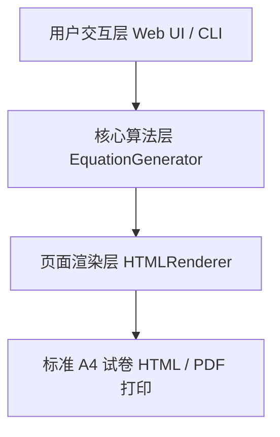

# 方程与方程组自动出题系统 (Equation Generator System)

## 📌 项目概述

本项目是一个用于自动生成**一元一次方程**、**二元一次方程组**与**三元一次方程组**的 Python 自动化出题系统。系统专为小学/初中数学方程专项训练设计，能够根据用户设定的题型和数量动态生成支持打印的 HTML 格式试卷，并且**保证所有方程均存在正整数解**（$x, y, z \in \mathbb{Z}^+$）。试卷末尾附带 180 度倒置印刷的参考答案，方便打印后翻转核对。

---

## 🏗️ 1. 系统设计思路

根据出题需求与试卷排版规范，系统的核心设计分为三层架构：



### 1.1 数学建模与解的保证机制
普通的方程随机生成器容易产生分数、小数或无解/无穷多解的情况。本系统采用**逆向约束构造法**保证正整数解：
1. **目标确定**：首先随机生成目标正整数解 $x, y, z \in [1, N]$（$N$ 可由用户配置，默认 15）。
2. **关系构造**：
   - **一元一次方程**：构造带多重括号与左右移项的等式，如 $k_1(a_1 x - b_1) - k_2(a_2 x - b_2) = k_3(a_3 x + b_3) + c$，根据已知 $x$ 反求常数项 $c$。
   - **二元/三元一次方程组**：生成系数矩阵 $A$，通过计算行列式 $\det(A) \neq 0$ 确保方程组线性无关（有唯一解），再利用 $A \cdot X = B$ 计算常数向量 $B$。
3. **代数式美化与规范**：
   - 系数为 $1$ 时隐藏系数（如 $1x \to x$）。
   - 系数为 $-1$ 时仅保留负号（如 $-1y \to -y$）。
   - 系数为 $0$ 时自动滤除该项，避免出现 `+ 0y` 或 `+ -3z` 的不规范写法。

### 1.2 试卷排版与倒置答案设计
- **标准试卷头**：包含标题、副标题以及学生“姓名”、“日期”、“得分”填空线。
- **方程组大括号排版**：使用 CSS flex 布局与 Times New Roman 字体的大括号 `{` 实现标准的数学方程组联立显示。
- **180 度倒置印刷**：利用 CSS `transform: rotate(180deg)`，将页脚的参考答案区域进行镜像倒置。试卷打印输出后，只需把纸张上下颠倒即可查阅答案，有效防止学生做题时提前瞟见答案。
- **打印样式优化**：使用 `@media print` 媒体查询，隐藏所有 UI 控件，保证打印页面纯净无杂质。

---

## 🛠️ 2. 系统实现细节

代码文件结构遵循低耦合、高内聚原则，模块划分如下：

```
linear/
├── docs/
│   └── readme.md               # 项目设计、实现与使用说明文档
├── equation_generator.py       # 核心出题算法类 EquationGenerator
├── html_renderer.py            # HTML 试卷模板渲染类 HTMLRenderer
├── web_server.py               # 原生 HTTP Web 交互服务端与仪表盘前端
├── main.py                     # 系统统一入口（支持 Web 模式与 CLI 模式）
├── sample_paper.html           # 自动生成的样卷示例
└── .gitignore                  # Git 忽略文件
```

### 2.1 核心模块说明

#### `equation_generator.py`
- `EquationGenerator.generate_linear_1var(difficulty, solution_max)`: 产生一元一次方程。
- `EquationGenerator.generate_linear_2var(difficulty, solution_max)`: 产生二元一次方程组。
- `EquationGenerator.generate_linear_3var(difficulty, solution_max)`: 产生三元一次方程组。
- `_format_term()` / `_format_paren()`: 格式化单项式与括号表达式，确保符号规范。

#### `html_renderer.py`
- `HTMLRenderer.render_paper(paper_title, questions)`: 组装题目列表，填入 CSS 样式与 HTML 模板，生成可直接打印的 HTML 文档。

#### `web_server.py`
- 基于 Python 标准库 `http.server.HTTPServer` 实现轻量级 Web 服务，无需安装 Flask 等第三方库。
- 提供路由 `/` 服务 Web 控制台前端，提供 POST `/api/generate` 接口响应出题请求。

#### `main.py`
- 主入口程序，解析命令行参数（`--cli` / `--title` / `--c1` / `--c2` / `--c3` / `--output`），灵活支持脚本批处理与 Web 交互两种运行模式。

---

## 📖 3. 使用说明指南

### 3.1 环境要求
- 操作系统：Windows / macOS / Linux
- Python 版本：Python 3.8 或更高版本
- 依赖项：**零第三方依赖**（全部采用 Python 标准库实现）

### 3.2 运行纯 HTML 单文件版（无需安装 Python 或任何依赖）

直接双击打开项目根目录下的 **[`index.html`](file:///E:/users/kpan/BaiduSyncdisk/doc/DingDang/study\math\linear\index.html)** 即可：
- 零依赖、无需后台服务或命令行。
- 采用纯前端 JavaScript 引擎在本地浏览器直接生成题目。
- 完整包含一元一次方程（含双重 `[()]` 及三重 `{[()]}` 嵌套括号）、二元方程组、三元方程组出题逻辑。
- 同样支持 180 度倒置答案印刷、一键 A4 打印与保存 HTML 文件。

### 3.3 启动 Python Web 可视化界面

在终端中运行以下命令（默认端口为 8080）：


```powershell
python E:\users\kpan\BaiduSyncdisk\doc\DingDang\study\math\linear\main.py
```
如需**指定端口号**（如使用 9000 端口）：
```powershell
python E:\users\kpan\BaiduSyncdisk\doc\DingDang\study\math\linear\main.py --port 9000
# 或
python E:\users\kpan\BaiduSyncdisk\doc\DingDang\study\math\linear\web_server.py -p 9000
```

系统会自动启动后台服务并自动在浏览器中打开对应页面（如 `http://localhost:9000`）：


1. **配置题目**：
   - 勾选需要的题型（一元一次方程、二元一次方程组、三元一次方程组）。
   - 输入每种题型的出题数量。
   - 选择题目难度（“进阶复杂型”或“基础标准型”）。
   - 设置正整数解的最大上限。
2. **生成与预览**：点击 **“🔄 生成/换一批题目”** 按钮，右侧面板将实时更新预览试卷。
3. **打印 / 导出**：
   - 点击 **“🖨️ 打印试卷 (A4/PDF)”**：直接调起系统打印机或导出为 PDF。
   - 点击 **“💾 导出 HTML 文件”**：下载独立网页文件存盘。

### 3.3 命令行 (CLI) 快速生成模式

适用于需要批量生成试卷文件或脚本调用的场景：

```powershell
# 运行 CLI 生成模式
python E:\users\kpan\BaiduSyncdisk\doc\DingDang\study\math\linear\main.py --cli --title "方程与方程组小测验" --c1 3 --c2 2 --c3 1 --output "E:\users\kpan\BaiduSyncdisk\doc\DingDang\study\math\linear\exam.html"
```

参数说明：
- `--cli`：启用命令行生成模式。
- `--title`：设置试卷标题。
- `--c1`：一元一次方程数量。
- `--c2`：二元一次方程组数量。
- `--c3`：三元一次方程组数量。
- `--difficulty`：题目难度（`advanced` 进阶复杂型，`basic` 基础型）。
- `--sol-max`：解的正整数上限（默认 15）。
- `--output`：输出 HTML 文件路径。

---

## 🖨️ 4. 打印与排版建议

1. **浏览器打印设置**：
   - 目标打印机：选择真实打印机或“另存为 PDF”。
   - 纸张大小：选择 **A4**。
   - 边距：选择**默认**或**窄边距**。
   - 背景图形：建议勾选“背景图形”（背景颜色与线条渲染更细腻）。
2. **答案核对方式**：
   - 试卷底部虚线以下的【参考答案】经过 180 度翻转。
   - 批改试卷时只需将打印好的纸张旋转 180 度（上下颠倒）即可轻松查阅参考答案。
