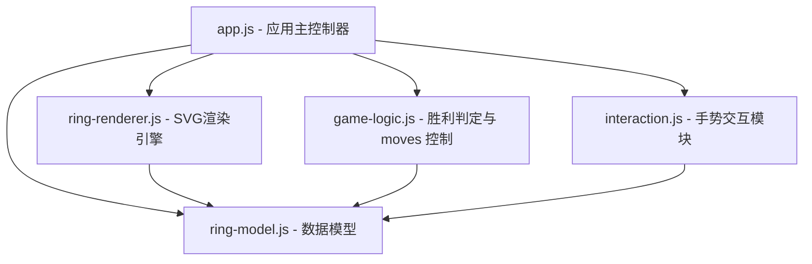

# Safe Cracker 50 - 游戏设计与技术说明文档

`Safe Cracker 50` 是一款基于实体木质机械拼图的数字逻辑对齐游戏。本软件使用 HTML5、SVG、Vanilla CSS 以及原生 JavaScript，在网页上 100% 还原了实体拼图的精美外观与物理联动特性。

---

## 1. 游戏介绍与规则

### 1.1 游戏背景
`Safe Cracker 50` 源自经典的木质同心圆数字谜题。游戏由 5 个同心圆环组成，每个圆环划分为 16 个等角扇区（对应 16 个半径方向的列）。

### 1.2 核心规则
* **双层叠放逻辑**：除最外圈外，每个环都包含上下两层。上层木板上有镂空的缺口（交替分布，有值的偶数位与镂空的奇数位交错）。当上层在某位置有值时，该位置显示上层数字；当上层镂空时，露出下层对应的数字。
* **胜利目标**：旋转这些同心圆环，使得所有 **16 个半径列**上可见的 5 个数字之和**恰好全部等于 50**。
* **唯一解性**：在超过 65,000 种可能的旋转排列组合中，有且仅有**唯一一个正确解**。

---

## 2. 物理旋转联动机制

在实体木质拼图玩具中，由于圆环从外到内层叠嵌套，下方的圆环面积较大，承载着上方的所有内圈圆环。因此，当玩家拨动外圈的某个环旋转时，放置在它上面的所有内圈环会因为物理摩擦和阶梯阻挡而**跟着同步旋转**；反之，当拨动最内侧的轻量环时，它会在下方的底座上滑动，而不会影响更外侧的重环。

在本项目中，我们通过算法 100% 还原了这种独特的物理体验：
* **旋转 环 B (Ring 4)**：联动带动其内部的 **环 C、环 D、环 E** 一同向同方向旋转。
* **旋转 环 C (Ring 3)**：联动带动其内部的 **环 D、环 E** 一同旋转。
* **旋转 环 D (Ring 2)**：联动带动最内部的 **环 E** 一同旋转。
* **旋转 环 E (Ring 1)**：仅自身旋转，不影响任何外圈环。
* **基座 (Ring 5)**：作为底座固定在最外侧，不可被旋转。

---

## 3. 数据与配置参数

游戏的半径分布及原始数据矩阵高度精确，采用以下的核心配置参数：

### 3.1 尺寸参数
* **扇区划分**：$N = 16$，每个扇区夹角为 $22.5^\circ$。
* **圆环半径范围**：
  * **Ring 5 (最外圈/基座)**：半径 $200px \sim 240px$
  * **Ring 4**：半径 $155px \sim 200px$
  * **Ring 3**：半径 $110px \sim 155px$
  * **Ring 2**：半径 $65px \sim 110px$
  * **Ring 1 (最内圈)**：半径 $30px \sim 65px$
  * **中心固定圆**：半径 $30px$
* **画布大小**：SVG 默认视口 $560px \times 560px$ (ViewBox: `-280 -280 560 560`)。

### 3.2 积木与层级映射关系
游戏中共有 5 个积木块（Block），每个积木块可能由一到两层数据绑定（旋转时同步转动）：
* **积木 A (基座 - 固定)**：包含最外圈底层 `down5` 和第四圈底层 `down4`。
* **积木 B (环 B - 可转)**：包含第四圈上层 `up4` 和第三圈底层 `down3`。
* **积木 C (环 C - 可转)**：包含第三圈上层 `up3` 和第二圈底层 `down2`。
* **积木 D (环 D - 可转)**：包含第二圈上层 `up2` 和第一圈底层 `down1`。
* **积木 E (环 E - 可转)**：仅包含最内圈上层 `up1`。

---

## 4. 视觉与设计理念

为了打造极为Premium（奢华质感）且清晰好玩的数字化模拟，设计上着重把握以下三点：

### 4.1 双色交替配色方案 (Alternating Palette)
为保证实体拼图的板块层次感，我们舍弃了多色渐变，采用了高端经典的**双色交替（白枫木与浅褐色）**设计。绑定的木板块使用同一材质颜色：
* **积木 A (最外)**：**白枫木**（Ivory White `#FAF6EE`）
* **积木 B**：**浅褐木**（Light Brown `#B28362`）
* **积木 C**：**白枫木**（Ivory White `#FAF6EE`）
* **积木 D**：**浅褐木**（Light Brown `#B28362`）
* **积木 E (最内)**：**白枫木**（Ivory White `#FAF6EE`）

通过这种冷暖、深浅的规律交替，拼图不仅立体感极强，并且将绑定的块与块之间的界限清晰地呈现在玩家面前。

### 4.2 文字高易读性保证 (Contrast & Legibility)
为了防止深色圆环掩盖文字，我们对“浅褐色”进行了精密的亮度微调（调浅至 `#B28362`），同时在 SVG 渲染层使用极具雕刻灼烧质感的深色文本（`#2C1810`）。这确保了**在白枫和浅褐木板上的数字都具有极佳的对比度，字迹高度清晰，长时间游玩也不会产生视觉疲劳**。

### 4.3 高交互品质 (Aesthetics & UX)
* **动态阴影与滤镜**：上层积木设置了投影滤镜 (`drop-shadow`)，凸显镂空层对底层的压叠质感。
* **指针拖拽高亮**：拖动时当前拨动的积木环会瞬间发光高亮（带有金黄色发光效果），并改变光标状态为抓取（`grabbing`）。
* **五档一键缩放栏**：提供 `100%`, `120%`, `140%`, `160%`, `200%` 五档选项，完美适配不同物理分辨率的大屏与小屏设备，且完美兼容拖动坐标精度。
* **胜利回馈**：触发胜利瞬间会在屏幕上自动绽放精美的纸屑喷洒庆祝动画（Confetti）。

---

## 5. 程序结构 (Architecture)

游戏采用经典的面向对象与模块化设计，结构清晰，职责单一（MVC 架构风格）：



* **`config.js`**：中心配置库。包含基础参数、半径范围、旋转绑定的积木定义以及木质原始数据矩阵。
* **`ring-model.js` (Model)**：核心数据模型。计算当前偏移值逻辑、管理层叠穿透数字显隐、提供列加和 API、执行同心环联动旋转转换。
* **`ring-renderer.js` (View)**：SVG 绘图引擎。根据 Model 的偏移数据动态生成扇区和文本路径，绘制阴影滤镜和外围 1-16 半径列号标签。
* **`interaction.js` (Controller)**：高级手势模块。捕捉 Mouse/Touch 事件，将屏幕直角坐标转换为转盘极坐标，计算旋转角度差，并进行 sector 物理对齐吸附。
* **`game-logic.js` (Logic)**：结果校验与状态管理器。计算 16 列的实时累加值并呈现在右侧面板中，判定胜利并激发庆祝 Confetti。
* **`app.js` (Entry)**：装配主入口。装配上述所有对象，绑定控制按钮和 5 档缩放面板事件。

---

## 6. 程序实现核心方法

### 6.1 联动旋转算法 (`ring-model.js`)
当玩家或按钮旋转某个 `blockId` 时，我们根据物理链式规则，向内部递归或迭代传播增量旋转：
```javascript
rotate(blockId, direction) {
    if (this.offsets[blockId] === undefined) return;

    const blocksToRotate = [];
    // 联动依赖：拨动外侧的环，其物理上承载的全部内圈环跟着转动
    if (blockId === 'blockB') {
        blocksToRotate.push('blockB', 'blockC', 'blockD', 'blockE');
    } else if (blockId === 'blockC') {
        blocksToRotate.push('blockC', 'blockD', 'blockE');
    } else if (blockId === 'blockD') {
        blocksToRotate.push('blockD', 'blockE');
    } else if (blockId === 'blockE') {
        blocksToRotate.push('blockE');
    }

    blocksToRotate.forEach(id => {
        if (this.offsets[id] !== undefined) {
            // N 为 16，循环模加减
            this.offsets[id] = (this.offsets[id] + direction + this.N) % this.N;
        }
    });
}
```

### 6.2 漏窗叠层可见值逻辑 (`ring-model.js`)
通过计算每个物理槽位（物理索引）施加旋转偏移后的逻辑索引，决定数字显示：
```javascript
getLayerValue(layerName, position) {
    const block = this.blocks.find(b => b.layers.includes(layerName));
    if (!block) return null;

    const layerData = this.data[layerName];
    if (!layerData) return null;

    // 固定底座直接返回
    if (!block.rotatable) {
        return layerData[position];
    }

    // 逻辑索引 = (物理位置 - 偏移步数) mod 16
    const offset = this.offsets[block.id] || 0;
    const logicalIndex = ((position - offset) % this.N + this.N) % this.N;
    return layerData[logicalIndex];
}

getVisibleValue(ringNumber, position) {
    if (ringNumber === 5) return this.getLayerValue('down5', position);

    const upValue = this.getLayerValue(`up${ringNumber}`, position);
    // 上层镂空则退回显示下层，否则优先显示上层
    return upValue !== null ? upValue : this.getLayerValue(`down${ringNumber}`, position);
}
```

### 6.3 缩放自适应手势精算 (`interaction.js`)
利用原生 API 动态读取 SVG 视口大小，完美解决了放大/缩小（即使大到 200%）后的拖拽精准度问题：
```javascript
_getSVGPoint(event) {
    // 动态获取当前的物理渲染包围盒，自适应 100% ~ 200% 的缩放尺寸
    const rect = this.svg.getBoundingClientRect();
    const svgWidth = this.svg.viewBox.baseVal.width;   // 固定 560
    const svgHeight = this.svg.viewBox.baseVal.height; // 固定 560
    const svgX = this.svg.viewBox.baseVal.x;           // 固定 -280
    const svgY = this.svg.viewBox.baseVal.y;           // 固定 -280

    // 计算当前显示像素与 viewBox 标准尺度的映射缩放比
    const scaleX = svgWidth / rect.width;
    const scaleY = svgHeight / rect.height;

    return {
        x: (event.clientX - rect.left) * scaleX + svgX,
        y: (event.clientY - rect.top) * scaleY + svgY
    };
}
```

---

## 7. 游戏思路与解题建议

### 7.1 定位绝对参考点
* **绝对锚点**：最外圈（`Ring 5` 底层 和 `Ring 4` 底层，即 `blockA`）是**完全固定不动**的。
* **解题启示**：任何时候，`Ring 5` 底座的 16 个数字以及在特定镂空位置露出的 `Ring 4` 底层数字是不可变的坐标源。不要漫无目的地乱转，所有的和值计算都应该以最外层为初始对齐标准。

### 7.2 理解链式联动效应
由于本款游戏引入了真实的联动结构，当你旋转外环时，内环会一并跟着偏移。
* **解题策略**：**从外向内，层层收敛**。
  1. 优先旋转 `blockB`（环 B）。通过旋转它，可以先去尝试匹配 Ring 5 与 Ring 4 底层的可见加和组合。
  2. 确定了外圈的局部对齐组合后，再转动 `blockC`（环 C）。这不会破坏 `blockB` 与最外层之间的相对位置，但可以逐步将 Ring 3 底部的数字调配到位。
  3. 依此类推，最后旋转最内层的独立积木 `blockE`（环 E）进行微调。

### 7.3 唯一解参数参考
经过全排列暴力计算，该拼图在以下旋转步数时会产生唯一正确的解（所有半径列和皆为 50）：
* **环 B (`blockB`)**：顺时针旋转 12 步。
* **环 C (`blockC`)**：顺时针旋转 8 步。
* **环 D (`blockD`)**：顺时针旋转 9 步。
* **环 E (`blockE`)**：顺时针旋转 13 步。
